# 🚀 Node.js Application Deployment using Jenkins CI/CD Pipeline


## 📌 Project Overview

This project demonstrates a complete CI/CD pipeline for deploying a Node.js application using Jenkins, GitHub Webhooks, and AWS EC2 instances.

The workflow automatically deploys application changes whenever code is pushed to the GitHub repository.

### Key Highlights

* Node.js Express Application
* Jenkins CI/CD Pipeline
* GitHub Webhook Integration
* AWS EC2 Deployment
* Automated Build & Deployment
* Remote Deployment via SSH
* Real-Time Continuous Delivery

---

# 🏗️ Architecture

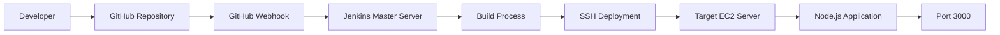

---

# 📂 Project Structure

```bash
nodejs_app_CICD/
│
├── app.js
├── package.json
├── jenkinsfile
├── README.md
│
└── screenshots/
    ├── jenkins_installation.png
    ├── manual-installation-of-node.png
    ├── master_security_group.png
    ├── pipeline_config.png
    ├── webhook_trigger.png
    ├── github_webhook_push.png
    ├── pipeline_console_output.png
    ├── output.png
    └── webhook_output.png
```

---

# ⚙️ Technologies Used

| Technology      | Purpose                |
| --------------- | ---------------------- |
| Node.js         | Backend Runtime        |
| Express.js      | Web Framework          |
| Jenkins         | CI/CD Automation       |
| GitHub          | Source Code Management |
| GitHub Webhooks | Automatic Trigger      |
| AWS EC2         | Infrastructure         |
| SSH             | Remote Deployment      |

---

# 🚀 Application Code

The application is a simple Express server that listens on port 3000 and displays a welcome message.

```javascript
const express = require('express');
const app = express();
const port = 3000;

app.get('/', (req, res) => {
  res.send('Hello from jenkins, added webhook');
});

app.listen(port, () => {
  console.log(`App listening at http://localhost:${port}`);
});
```

---

# 🔧 Prerequisites

Before starting, make sure you have:

* AWS Account
* Two EC2 Instances

  * Jenkins Master
  * Target Deployment Server
* GitHub Account
* Jenkins Installed
* Node.js Installed

---

# ☁️ AWS Infrastructure Setup

## Jenkins Master Server

Responsibilities:

* Jenkins Installation
* GitHub Integration
* Pipeline Execution
* Deployment Triggering

### Jenkins Installation

```bash
sudo apt update
sudo apt install openjdk-21-jre -y

curl -fsSL https://pkg.jenkins.io/debian-stable/jenkins.io-2023.key | sudo tee \
  /usr/share/keyrings/jenkins-keyring.asc > /dev/null

echo deb [signed-by=/usr/share/keyrings/jenkins-keyring.asc] \
  https://pkg.jenkins.io/debian-stable binary/ | sudo tee \
  /etc/apt/sources.list.d/jenkins.list > /dev/null

sudo apt update
sudo apt install jenkins -y

sudo systemctl start jenkins
sudo systemctl enable jenkins
```

---

# 📸 Screenshots

## 1️⃣ Jenkins Installation on Master Server

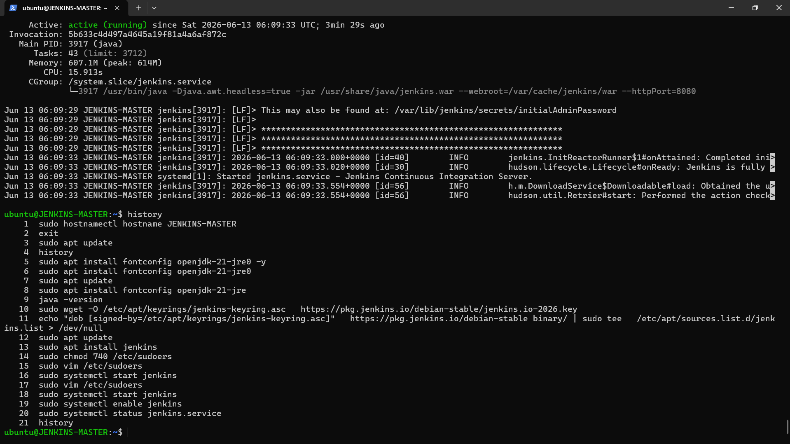

---

## 2️⃣ Node.js Installation on Target Server

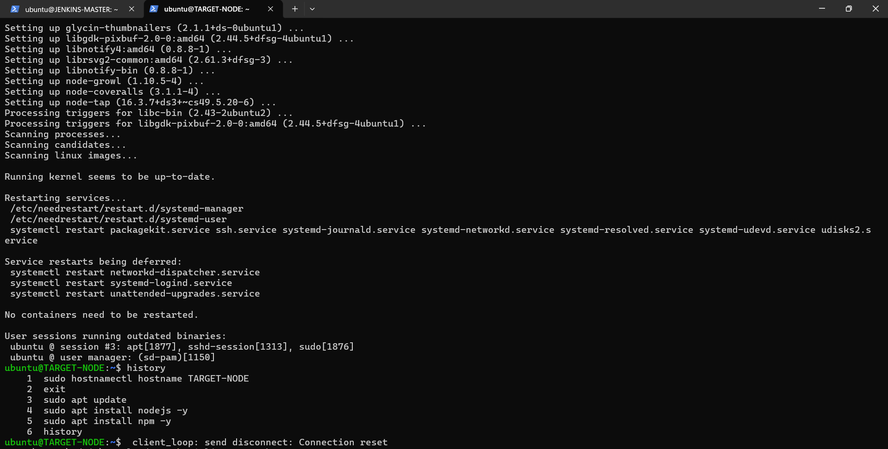

---

## 3️⃣ AWS Security Group Configuration

Opened Ports:

* 22 (SSH)
* 80 (HTTP)
* 8080 (Jenkins)

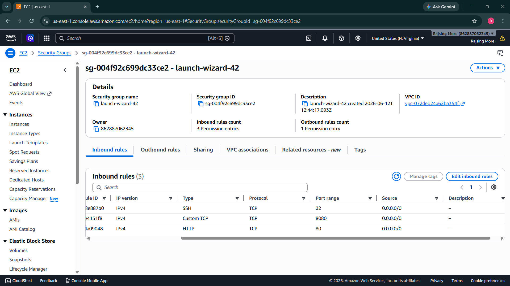

---

# 🎯 Target Server Setup

Install Node.js:

```bash
sudo apt update
sudo apt install nodejs -y
sudo apt install npm -y
```

Verify Installation:

```bash
node -v
npm -v
```

---

# 🔐 SSH Connectivity

Generate SSH Key on Jenkins Server:

```bash
ssh-keygen
```

Copy Public Key:

```bash
ssh-copy-id ubuntu@TARGET_SERVER_IP
```

Verify Connection:

```bash
ssh ubuntu@TARGET_SERVER_IP
```

---

# 🔄 Jenkins Pipeline Configuration

Create a new Pipeline Job:

* New Item
* Pipeline
* Pipeline Script from SCM
* Git Repository URL

Repository:

```text
https://github.com/RajsingMore-0151/nodejs_app_CICD.git
```

### Jenkins Pipeline Configuration

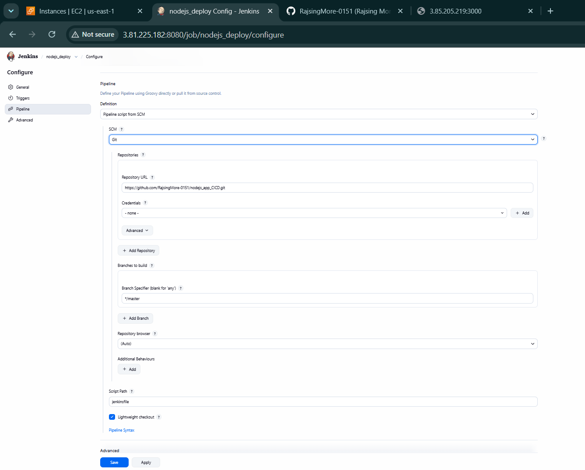

---

# 🔗 GitHub Webhook Configuration

Navigate to:

```text
GitHub Repository
→ Settings
→ Webhooks
→ Add Webhook
```

Payload URL:

```text
http://JENKINS_PUBLIC_IP:8080/github-webhook/
```

Content Type:

```text
application/json
```

Event:

```text
Just the push event
```

---

## Webhook Trigger Configuration

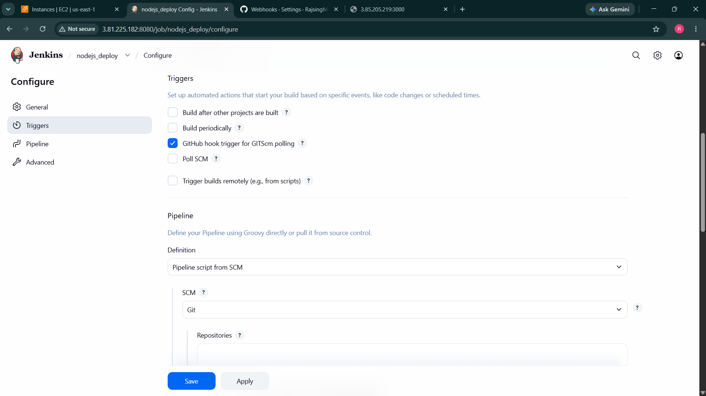

---

## Successful Webhook Delivery

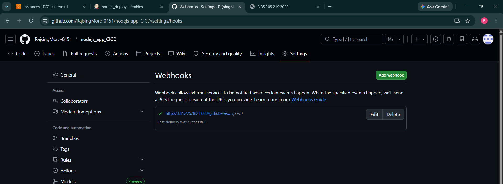

---

# ⚡ Jenkins Trigger Setup

Enable:

```text
GitHub hook trigger for GITScm polling
```

This allows Jenkins to automatically start builds whenever code is pushed.

---

# 🚀 Deployment Pipeline Flow

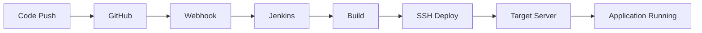

---

# 📋 Jenkins Build Output

Successful deployment logs from Jenkins pipeline.

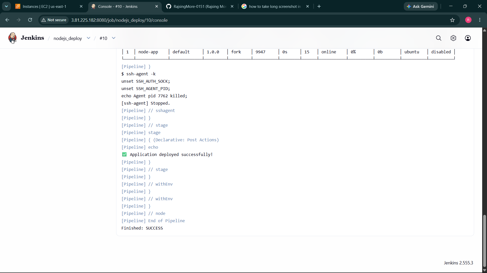

---

# 🌐 Application Output

After deployment, the application becomes accessible via:

```text
http://SERVER_PUBLIC_IP:3000
```

---

## Initial Deployment Output

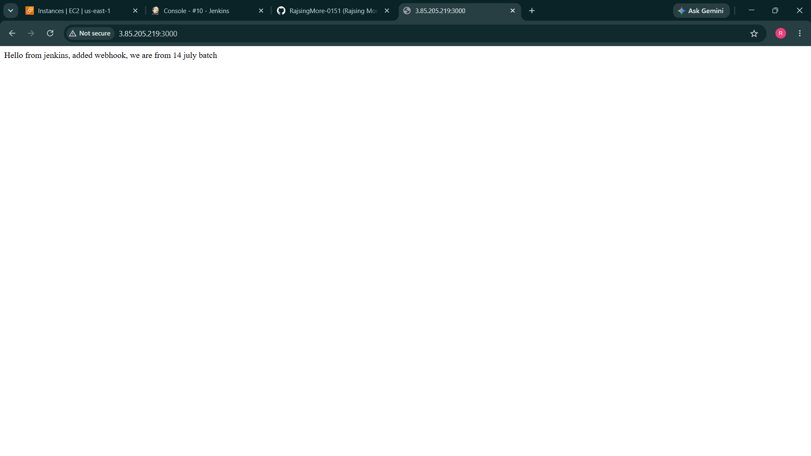

---

## Webhook Triggered Deployment Output

After code changes are pushed to GitHub, Jenkins automatically deploys the latest version.

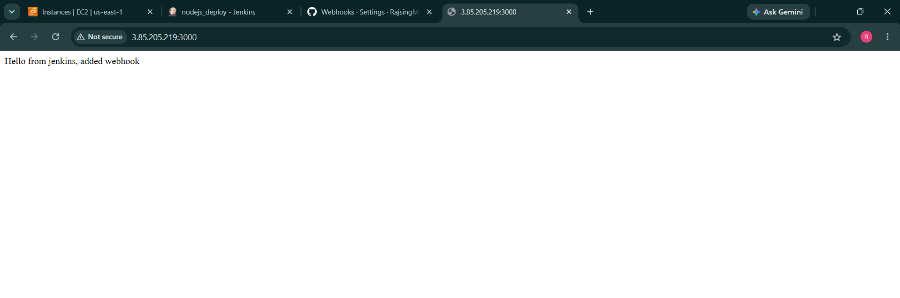

---

# 🧪 Testing

Verify Application:

```bash
curl http://SERVER_PUBLIC_IP:3000
```

Expected Output:

```text
Hello from jenkins, added webhook
```

---

# 🎯 CI/CD Workflow

1. Developer pushes code to GitHub.
2. GitHub sends webhook notification.
3. Jenkins receives webhook.
4. Jenkins starts pipeline automatically.
5. Source code is cloned.
6. Dependencies are installed.
7. Application is deployed to target server.
8. Updated application becomes live.

---

# 📈 Future Enhancements

* Docker Containerization
* Kubernetes Deployment
* SonarQube Integration
* Automated Testing
* Slack Notifications
* AWS CodeDeploy Integration
* Monitoring with Prometheus & Grafana

---
